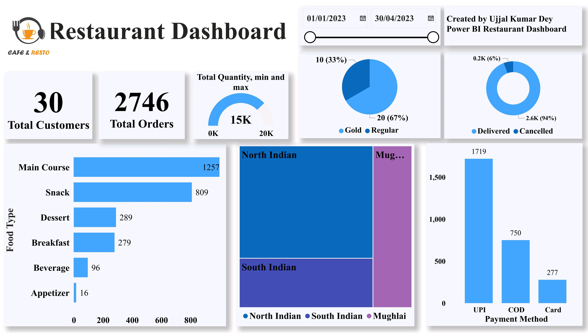
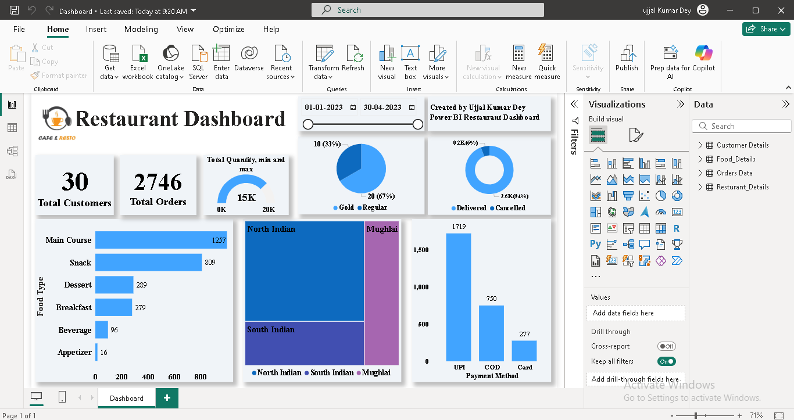
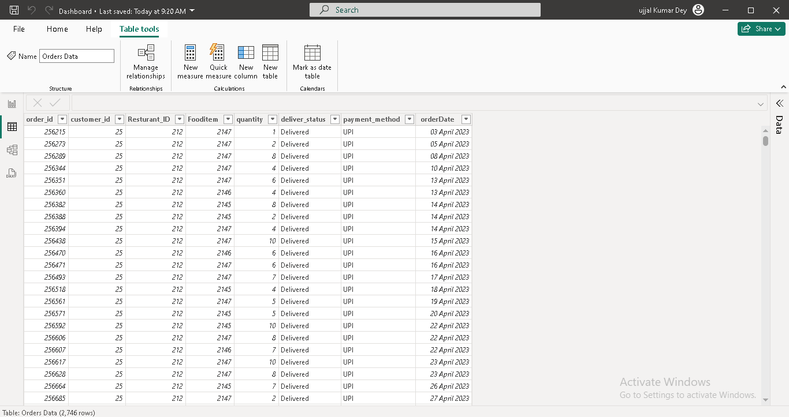
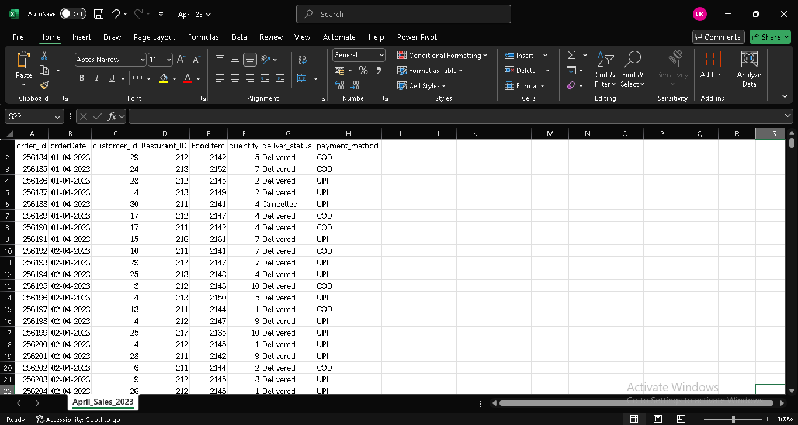

# 🍽️ Restaurant Sales Dashboard - Power BI

This interactive Power BI dashboard offers a comprehensive overview of restaurant sales between January 1, 2023 – April 30, 2023. It allows users to analyze key performance metrics like total customers, orders, food category demand, delivery rates, and payment preferences.

Designed with clean visuals and slicers, this dashboard helps stakeholders make informed decisions about customer behavior, top-performing dishes, and operational efficiency.

## 📊 Key Features

- 👥 Total Customers & Total Orders
- 📈 Food Category Analysis (Bar Chart)
- 🎯 Quantity Gauge Chart (Min, Max, and Total Quantity)
- 📊 Customer Type Split – Gold vs Regular (Pie Chart)
- 🔄 Order Status Split – Delivered vs Cancelled (Donut Chart)
- 🍛 Cuisine-Type Popularity – Treemap (North, South, Mughlai)
- 💳 Payment Method Preferences – UPI, COD, Card (Bar Chart)
- 📆 Date Range Slicer for dynamic filtering

## 📁 Project Structure
📁 Restaurant-Sales-Dashboard
│── Dashboard.png      # Main dashboard preview image
│── Dashboard.xlsx     # Excel file with pivot tables and dashboard
│── main.png           # Duplicate or alternate view of dashboard (optional)
│── pivot.png          # Screenshot of pivot table setup
│── Source.csv         # Raw data used for the analysis
│── source.png         # Screenshot of raw data structure (optional)
│── README.md          # Project documentation (this file)

## 🚀 🚀 How to Use

> ⚠️ The Power BI `.pbix` file is not included in this repository to prevent unauthorized use.  
> However, you can recreate the dashboard using the raw Excel files provided.
 
1. Install [Power BI Desktop](https://powerbi.microsoft.com/desktop/).
2. Open Power BI.
3. Go to **Home → Get Data → raw.xlsx file.
4. Go to **Home → Get Data → Folder** and select the `Orders Data/` directory.
5. Load and combine the Excel files.
6. Clean, model, and build your own dashboard using Power BI tools.

## 🖼️ Screenshots

  
   <em>Dashboard</em>

  
   <em>Data Visualization</em>

  
   <em>Transformed Data</em>

  
   <em>Raw Data</em>

## 📊 Key Insights

- 👥 **Total Customers**: 30  
- 🧾 **Total Orders**: 2,746  
- 🛒 **Total Quantity Ordered**: 15,000 items  
- 🍽️ **Most Ordered Food Type**: Main Course (1,257 orders)  
- 🥤 **Least Ordered**: Appetizer (16 orders)  
- 🛍️ **Customer Types**: 67% Regular, 33% Gold  
- 📦 **Order Status**: 94% Delivered, 6% Cancelled  
- 💳 **Top Payment Method**: UPI (1,719 orders)  
- 🍛 **Popular Cuisine**: North Indian  

 ## 🛠️ Tools Used

- **Power BI Desktop** – Dashboard creation
- **DAX** – Calculated columns and measures
- **Power Query** – Data cleaning and transformation
- **CSV Dataset** – Source data

## 🔮 Future Scope

- Add **Profit and Revenue KPIs**
- Include **Time of Day Analysis**
- Add **Branch-wise Analysis** (if multi-branch)

## 👨‍💻 Contributors

- **Ujjal Kumar Dey** – *Power BI Developer*
